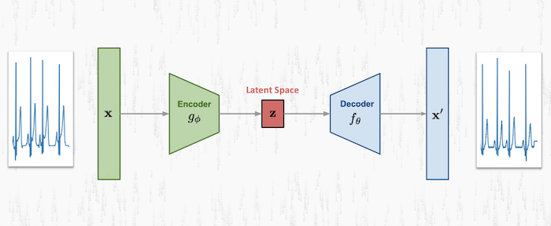
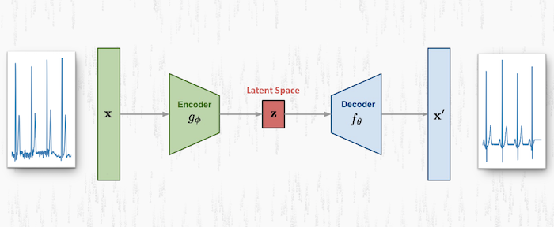
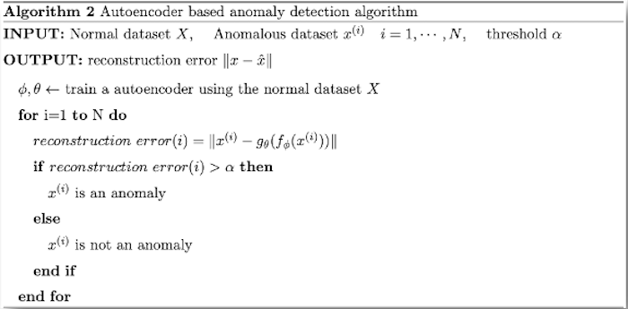
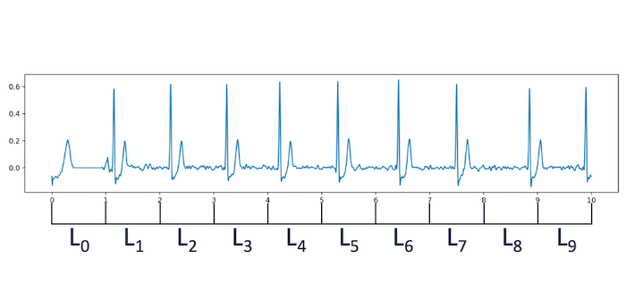
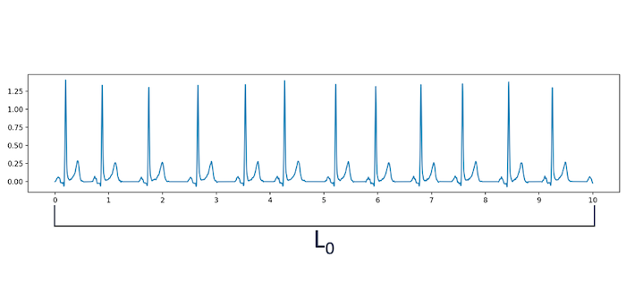

# README #

For my **Master's Degree Thesis** i've developed an Artificial System which is able to identify **arrhythmia episodes** in 15-leads ECG.   
   
The problems of identifying arrhythmias in ECG has been addressed as **Semi-Supervised Anomaly Detection Task**. So, in this context, arrhythmias can be seen as anomalies into normal ECGs.   
   
The system's core is a Deep Convolutional AutoEncoder to whom i've given the name **DPNet**. DPNet is not open-suorce (yet?).           

## Main Idea ##

The idea behind this system is the following: **You can't recreate what you don't recognise**.    
   
This idea is concretized by training the Autoencoder using only normal ECGs, in such a way, the net will learn their salient features and so, it will be able to recreate them with a low reconstruction error.  
    
Dually, during the test, when to the net will be also fed anomalous data containing arrhythmias, the net won't be able to reconstruct them properly. The fact is that anomalous samples have salient features that are way different from the normal's ones.    
This is what happens graphically:   

**1° Lead Normal Sample Reconstrucion.**    
     
       
**1° Lead Atrial Fibrillation Sample Reconstrucion.**   
    
   
So, the **reconstruction error** can be used as an **anomaly indicator**.   
   
This is the idea behind an Autoencoder-based anomaly detection [algorithm](http://dm.snu.ac.kr/static/docs/TR/SNUDM-TR-2015-03.pdf).   
   

## Features ##

The proposed system differs from the others for a number of reasons:
    
* It's a **General Purpose** system while competitors are Special Purpose.      

* Supports **15-leads ECGs** instead competiors are limited to 12-leads ones.   

* Can process **Arbitrary ECGs** without any specific segmentation algorithm (e.g. R-R interval segmentation) like competitors do.

### Greatest Strength ###

The provided system drastically reduces the human component required to build this kind of systems.   

**Competitors require totally labeled data** in order to be realized. So, for a given ECG and for each portion that can be extracted from it, it's necessary a human expert (i.e. a Cardiologist) to label the portion.   
   
**Competitor Labelling.**     
   
    
In contrast, **the provided system, requires only a sufficiently large number of normal samples**!   
So, we move from the competitors' approch in which a label per portion is required to one in which all you need is a label for each normal ECG.   
    
**Provided System Labelling.**     
   

## Evaluation ##

DPNet has been evaluated in term of ROC Curve and AUC Score. It'has obtained an **AUC Score of 0.8002** which certifies both the model's quality and robustness to noise.    